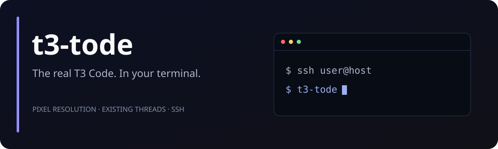

# t3-tode



**T3 Code, inside your terminal. Even over SSH.**

The actual T3 Code web interface rendered at your terminal's pixel resolution. Existing threads, projects, agents, diffs, and settings—all backed by the real T3 Code server.

[](https://github.com/Belweave/t3-tode/actions/workflows/ci.yml)
[](https://github.com/Belweave/t3-tode/releases/latest)
[](LICENSE)

## Install

**macOS / Linux**

```sh
curl -fsSL https://raw.githubusercontent.com/Belweave/t3-tode/main/install.sh | bash
```

**Windows — installs inside your default WSL2 Linux distribution**

```powershell
irm https://raw.githubusercontent.com/Belweave/t3-tode/main/install.ps1 | iex
```

Then open a new compatible terminal and run:

```sh
t3-tode
```

The installer reuses a compatible Node installation and supports **npm, pnpm, and Bun**. If Node is missing or too old, it downloads a private pinned Node 24 LTS runtime. It verifies release/runtime SHA-256 checksums, installs locked dependencies, and adds `~/.local/bin` to common shell profiles. On Debian/Ubuntu, missing Chromium libraries may require `sudo`. Run as your normal user, without `sudo`. Updates use the same install command and switch versions only after installation succeeds.

**Terminal requirement:** [Ghostty](https://ghostty.org), [Kitty](https://sw.kovidgoyal.net/kitty/), or [cmux](https://www.cmux.dev/) with Kitty graphics support. A traditional text-only terminal cannot display the interface.

**Windows:** set up WSL2 and a non-root Linux user first (`wsl --install -d Ubuntu`), then run the PowerShell command. Launch from Kitty or Ghostty inside WSLg. Windows Terminal does not support the required graphics protocol. This is a Linux installation in WSL, not a native Windows app; it uses the WSL T3 environment rather than automatically sharing native Windows desktop data. WSL installation is not yet tested end to end.

> Independent project by Belweave, inspired by [Tode](https://terminal-code.com/). Uses the official upstream T3 Code web client and backend; not affiliated with or endorsed by T3 Code.

## Your existing T3 Code, in the terminal

`t3-tode` discovers the running server in `~/.t3`, pairs through its matching official CLI, and displays its existing threads and projects. It does not copy conversations into a separate database or create an empty environment by default.

On macOS, it can use the CLI bundled in your installed T3 Code app. On Linux, it uses `t3` on PATH; a pinned T3 release is included for fresh environments. Pairing with an existing server requires a CLI matching that server's version. Use `--t3-command /path/to/t3` when needed.

If no server is running, the launcher starts one using the same state directory. Quitting stops only a server it started; an attached desktop app or service remains running. Existing state without a recognized bundled version requires an installed T3 CLI, to avoid silently opening it with a different bundled release.

A fresh environment opens T3's normal onboarding. Install and authenticate at least one coding provider on that machine, for example `codex login` or `opencode auth login`. T3's settings manage the providers and models; t3-tode does not supply API credentials.

## SSH: log in, launch, work

Install t3-tode on the target machine, then:

```sh
ssh user@host
t3-tode
```

Rendering runs on the remote machine; pixel frames and input travel through your existing SSH connection. No X forwarding, desktop session, browser port forwarding, or exposed backend port required. Linux without `DISPLAY` or `WAYLAND_DISPLAY` uses Pixel's headless Chromium platform. Each machine retains its own T3 environment and provider credentials.

Use a Kitty graphics terminal on your local machine. Intermediate multiplexers must pass the graphics/input sequences through; start in a direct SSH session when troubleshooting. Frame updates depend on connection bandwidth. For a backend that survives disconnects, run T3 separately as a service and let t3-tode attach to it.

## What you get

- The complete upstream interface: threads, streaming responses, provider/model selection, approvals, plans, attachments, projects, worktrees, Git diffs, terminals, search, and settings.
- Pixel rendering that follows terminal size, with mouse input, keyboard input, clipboard access, popups, and adjustable UI zoom.
- Persistent browser authentication and exclusive profile ownership.
- Loopback-only owned servers, redacted bounded backend logs, and cleanup on startup failure or exit.

Feature availability follows your upstream T3 version, providers, and server capabilities. Desktop-only file dialogs, OS integrations, and clipboard behavior over SSH can differ from the desktop app.

## Usage

```sh
t3-tode                         # Existing environment, no new project/thread
t3-tode /path/to/project         # Bootstrap project when starting a server
t3-tode --zoom 1.25              # Scale the interface
t3-tode --state-dir /srv/t3      # Another T3 state directory
t3-tode --new-server .           # Explicit isolated environment
t3-tode --url 'http://127.0.0.1:3773/pair#token=YOUR_TOKEN'
t3-tode --url https://t3.example.com
t3-tode --profile /path/to/profile
t3-tode --serve                  # Backend/connection only; prints pairing link
t3-tode --doctor
t3-tode --help
```

**Ctrl+Q** quits. Terminal-level shortcuts may intercept keys before T3 receives them; mouse controls remain available.

`--url` accepts a pairing link from T3 Connections settings, or a plain URL after the profile has paired. Remote HTTPS servers are supported. Treat pairing links as credentials; `--serve` prints one, so avoid capturing that output in public logs. Only connect to servers you trust.

`--new-server` uses `~/.local/share/t3-tode/backend`, separate from your default `~/.t3` environment. Owned servers default to port 4773; `--port` overrides it. This shell creates a normal upstream authenticated web client session rather than using a separate private protocol.

## Platforms

| Platform | Support |
| --- | --- |
| macOS Apple Silicon | Native; rendering and existing desktop connection verified |
| Linux x64 / arm64 | Native; glibc-based distributions, Chromium system libraries required |
| macOS Intel | Renderer available; bundled T3 has no Intel binary, so a compatible upstream CLI/build is required |
| Windows | WSL2 Linux route; no native Pixel Windows build |

The app runs on Node; Bun is supported as a package manager, rather than replacing the required Node runtime. A compatible installed Node is reused. Source development also supports Node `^22.16`, `^23.11`, or `>=24.10`. Alpine/musl is not supported by the shipped Chromium runtime. On hardened Linux systems, Chromium may need a per-binary AppArmor permission; Pixel prompts for the upstream setup. The launcher never disables the Chromium sandbox.

## Updates, customization, removal

Rerun the install command to update. It retains prior application versions and leaves T3 data and browser profiles intact. [Release notes](https://github.com/Belweave/t3-tode/releases) document changes.

```sh
# Pin a release; these variables are passed to bash, not curl.
curl -fsSL https://raw.githubusercontent.com/Belweave/t3-tode/main/install.sh | T3_TODE_VERSION=v0.1.1 bash
```

Choose your package manager explicitly (auto-detection prefers an existing npm, then pnpm, then Bun):

```sh
curl -fsSL https://raw.githubusercontent.com/Belweave/t3-tode/main/install.sh | T3_TODE_PACKAGE_MANAGER=pnpm bash
# Or T3_TODE_PACKAGE_MANAGER=bun
```

No global Node or package-manager version is replaced. `T3_TODE_NODE_DOWNLOAD=1` opts into a private runtime even if a compatible Node is installed.

Installer options: `T3_TODE_INSTALL_DIR` (default `~/.local/share/t3-tode/app`), `T3_TODE_BIN_DIR` (default `~/.local/bin`), and `T3_TODE_NO_MODIFY_PATH=1` to leave shell profiles untouched. Installation paths must be absolute.

Default removal:

```sh
rm -f ~/.local/bin/t3-tode
rm -rf ~/.local/share/t3-tode/app
```

Remove the `# t3-tode PATH` lines from your shell profiles. Your `~/.t3` backend data and `~/.local/share/t3-tode/browser` profile remain intact.

## Troubleshooting

- **Only an empty/new environment:** use the default command, not `--new-server`. Confirm the desktop/service uses the same `--state-dir` and user account.
- **Version mismatch:** start the matching T3 app, install the matching `t3` CLI, or pass `--t3-command`. No database copying is needed.
- **Profile already open:** quit the other client or use a separate `--profile`. After a crash, a stale `.t3-tode-lock` may remain; verify no client is using that profile before removing the named lock file. Stale locks are not automatically deleted while another process could be acquiring them.
- **Linux launch fails:** check system-library and sandbox errors, run as a non-root user, and run `t3-tode --doctor`. Pixel writes renderer diagnostics to the system temporary directory.
- **Blank/unsupported terminal:** try a direct session in Ghostty or Kitty without a multiplexer. Confirm Kitty graphics support.

[Report a bug](https://github.com/Belweave/t3-tode/issues/new/choose) with OS, architecture, terminal/version, local vs SSH, and redacted `--doctor` output.

## Develop

```sh
git clone https://github.com/Belweave/t3-tode.git
cd t3-tode
npm ci
npm test
npm start -- --new-server /path/to/project
```

See [CONTRIBUTING.md](CONTRIBUTING.md), [verification](docs/verification.md), and [backend research](docs/backend-research.md). This release does not exhaustively test every upstream feature; real Windows/WSL and remote SSH sessions remain in the verification backlog.

## Credits and license

MIT. Built on [T3 Code](https://github.com/pingdotgg/t3code) and [Pixel](https://github.com/zenbu-labs/terminal-browser), inspired by [terminal-code / Tode](https://github.com/zenbu-labs/terminal-code). Upstream projects retain their respective licenses and trademarks. See [THIRD_PARTY_NOTICES.md](THIRD_PARTY_NOTICES.md).
